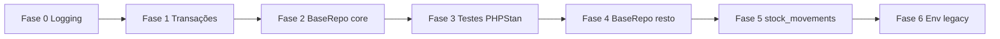

# Plano de implementação — Débito técnico

Plano derivado de [debito-tecnico.md](debito-tecnico.md) (revisão mai/2026). Objetivo: reduzir risco de regressão, padronizar camadas Core/Repositories/Services e aumentar cobertura de testes **sem parar entregas de negócio**.

**Como usar:** executar fases em ordem quando possível; dentro de cada fase, tarefas podem ser divididas em PRs pequenos (1 repositório ou 1 service por PR).

**Verificação contínua (cada PR):**

```bash
composer check
php bin/check-route-permission-map.php
php bin/check-encoding.php
```

---

## Visão geral das fases

| Fase | Foco | Duração sugerida | PRs estimados |
|------|------|-----------------|--------------|
| **0** | Vitórias rápidas (logging, docs) | 0,5–1 dia | 1 |
| **1** | Transações padronizadas | 2–3 dias | 2–3 |
| **2** | `BaseRepository` — núcleo comercial/financeiro | 4–6 dias | 5 |
| **3** | Qualidade (testes + PHPStan 6) | 3–5 dias | 2–4 |
| **4** | `BaseRepository` — restante | 5–8 dias | 6–10 |
| **5** | Schema `stock_movements` (opcional) | 3–5 dias | 2–3 |
| **6** | Limpeza `Env::loadLegacy` | 0,5 dia | 1 |

**Total estimado:** 18–28 dias úteis (1 dev), ou 4–6 semanas com entregas paralelas de features.



---

## Fase 0 — Vitórias rápidas ✅ (mai/2026)

**Objetivo:** baixo risco, melhora observabilidade imediata.

### 0.1 — Logger em vez de `error_log` ✅

| Campo | Conteúdo |
|-------|----------|
| Arquivos | `app/Services/ApiLogService.php`, `app/Services/AuditService.php` |
| Ação | Trocar `error_log(...)` por `Logger::warning()` / `Logger::exception()` com contexto (`log_id`, `user_id`, etc.) |
| Critério de aceite | Nenhum `error_log` nesses services; falhas de log API/auditoria continuam não quebrando o fluxo principal |

### 0.2 — Atualizar checklist interno ✅

| Campo | Conteúdo |
|-------|----------|
| Arquivos | `docs/bugs/debito-tecnico.md` |
| Ação | Seção Logging marcada como concluída (mai/2026) |

---

## Fase 1 — Transações (`Database::transaction`) ✅ (mai/2026)

**Objetivo:** mesmo padrão de rollback/commit dos fluxos de venda e pagamento.

**Ordem recomendada:** `StockService` primeiro (mais crítico para estoque), depois `ProductService`.

### 1.1 — `StockService` ✅

| Campo | Conteúdo |
|-------|----------|
| Escopo | Métodos com `beginTransaction` / `commit` / `rollBack` manual |
| Ação | Envolver corpo transacional em `Database::transaction(function (PDO $pdo) { ... })`; injetar `$pdo` em `StockMovementRepository` / `ProductRepository` quando `$manageTransaction === false` |
| Testes | Estender ou criar teste de integração: movimentação + estoque consistente em falha simulada |
| Critério de aceite | Sem `beginTransaction` manual no arquivo; `composer test` verde |

### 1.2 — `ProductService` ✅

| Campo | Conteúdo |
|-------|----------|
| Escopo | Dois blocos transacionais (create/update com categorias relacionadas, se houver) |
| Ação | Mesmo padrão da fase 1.1 |
| Critério de aceite | CRUD produto/serviço inalterado em comportamento; transação única por operação |

### 1.3 — Demais services ✅

| Service | Prioridade | Notas |
|---------|------------|-------|
| `AuthService` | Média | Reset de senha / transação de usuário |
| `UserService` | Média | Admin usuários |
| `CompanyService` | Baixa | Onboarding/admin |
| `OnboardingService` | Baixa | Fluxo único no primeiro acesso |
| `SubscriptionBillingService` | Baixa | SaaS |

**Critério de aceite da fase:** zero ocorrências de `beginTransaction` em `app/Services/` exceto dentro de `Database.php`.

---

## Fase 2 — `BaseRepository` (núcleo alto tráfego) ✅ (mai/2026)

**Objetivo:** PDO injetável nos repositórios mais usados em venda, estoque e financeiro.

**Modelo de migração (repetir por repositório):**

1. `class XRepository extends BaseRepository`
2. Remover propriedade `$db` duplicada e construtor que chama `Database::getConnection()` direto
3. Usar `$this->db` da base (ou `protected PDO $db` herdado)
4. Garantir que services que já passam `$pdo` em transação continuam funcionando: `new XRepository($pdo)`
5. PR único por repositório; rodar `composer check`

### 2.1 — Ordem sugerida

| # | Repositório | Motivo |
|---|-------------|--------|
| 1 | `ProductRepository` | Estoque + vendas + inventário |
| 2 | `OrderRepository` | Vendas |
| 3 | `OrderItemRepository` | Itens de venda (usar junto com Order) |
| 4 | `AccountsReceivableRepository` | Financeiro |
| 5 | `PaymentRepository` | Recebimentos |
| 6 | `PixChargeRepository` | PIX |
| 7 | `StockMovementRepository` | Movimentações |

### 2.2 — Concern `CompanyScope`

| Campo | Conteúdo |
|-------|----------|
| Verificação | Repositórios com `use CompanyScope` devem continuar chamando `$this->companyId()` |
| Ação | Se útil, documentar em `BaseRepository` que traits como `CompanyScope` permanecem nos filhos |

**Critério de aceite da fase:** 7 repositórios migrados; fluxos manuais: nova venda, recebimento, PIX, movimentação de estoque.

---

## Fase 3 — Qualidade (testes + PHPStan)

**Objetivo:** detectar regressões cedo e subir barreira estática.

### 3.1 — Testes de integração (prioridade)

| Módulo | Cenários mínimos |
|--------|------------------|
| Financeiro | Recebimento parcial/total em AR; parcela paga; status do pedido `pending` → `paid` |
| Estoque | Entrada/saída; estoque insuficiente; inventário físico finalizado |
| Cancelamento | Venda cancelada com estorno; bloqueio se AR paga |

**Arquivos alvo:** `tests/Integration/` — reutilizar `RequiresPostgresTrait` e dados seed existentes.

### 3.2 — PHPStan nível 6

| Passo | Ação |
|-------|------|
| 1 | `phpstan analyse` com `level: 6` em branch dedicada |
| 2 | Corrigir ~14 avisos de `array` sem value-type (PHPDoc `@param array<string, mixed>` ou DTOs) |
| 3 | Remover `ignoreErrors` obsoletos em `phpstan.neon` |
| 4 | Atualizar `composer analyse` / CI |

**Critério de aceite:** `composer analyse` verde no nível 6; pelo menos +3 classes de teste de integração novas.

### 3.3 — (Opcional) Testes com PDO mock

| Campo | Conteúdo |
|-------|----------|
| Escopo | 1–2 services estáveis (`PaymentService` ou `OrderService`) |
| Ação | Introduzir padrão de teste double para repositório (interface ou stub PDO) — **só após** Fase 2 nos repos usados |

---

## Fase 4 — `BaseRepository` (repositórios restantes)

**Objetivo:** completar padronização (~20 repositórios restantes).

### 4.1 — Lotes sugeridos

| Lote | Repositórios |
|------|----------------|
| **Admin** | `User`, `Company`, `UserCompany`, `Permission`, `Audit`, `AccessLog` |
| **Catálogo** | `Category`, `Notification` |
| **Relatórios/API** | `Report`, `Dashboard`, `ApiLog`, `ApiRateLimit` |
| **SaaS/backup** | `Plan`, `Subscription`, `SubscriptionInvoice`, `BackupLog`, `BackupSettings`, `LgpdConsent` |
| **Caixa** | `CashFlow` |

### 4.2 — Meta final repositórios

| Métrica | Alvo |
|---------|------|
| Repositórios em `BaseRepository` | 33/33 (exceto se algum for apenas helper estático) |
| Construtores duplicados com `Database::getConnection()` | 0 |

**Critério de aceite:** `composer check`; smoke test por área do menu.

---

## Fase 5 — Schema `stock_movements.company_id` (opcional / alto impacto)

**Objetivo:** simplificar queries multi-tenant e reduzir risco de join esquecido.

### 5.1 — Spike (meio dia)

| Entrega | Descrição |
|---------|-----------|
| ADR curto | `docs/arquitetura/adr-stock-movements-company-id.md` — prós/contras, plano de backfill |
| Inventário | Listar queries em `StockMovementRepository`, relatórios, dashboard |

### 5.2 — Implementação (se aprovado)

| Passo | Ação |
|-------|------|
| 1 | Migration: `ALTER TABLE stock_movements ADD company_id`; backfill via `products.company_id` |
| 2 | `NOT NULL` + FK + índice `(company_id, created_at)` |
| 3 | Atualizar inserts em `StockMovementRepository` / `StockService` |
| 4 | Simplificar SELECTs (remover joins redundantes onde seguro) |
| 5 | Atualizar `database.sql` e doc em `docs/arquitetura/banco.md` |

**Critério de aceite:** isolamento por empresa em movimentações sem depender só de join; `TenantIsolationTest` ou teste equivalente para estoque.

**Risco:** migration em base grande — executar em janela de manutenção; testar restore de backup.

---

## Fase 6 — Remover `Env::loadLegacy`

| Campo | Conteúdo |
|-------|----------|
| Pré-requisito | Deploy sempre com `composer install` e Dotenv |
| Ação | Remover `loadLegacy()` e testes associados; documentar em `docs/arquitetura/devops.md` |
| Critério de aceite | Boot com `.env` válido e inválido (mensagem clara); CI verde |

---

## Itens fora deste plano (já resolvidos ou operacionais)

Não replanejar:

- Gateway PIX Mercado Pago (código pronto — só `.env` em produção)
- ACL hub `/reports` (`canAccessReportsHub`)
- Mensagens PT em estoque/venda web
- `RoutePermissionMap` manual — manter script `bin/check-route-permission-map.php` em todo PR com rotas novas

---

## Governança de PRs

| Regra | Detalhe |
|-------|---------|
| Tamanho | Preferir &lt; 400 linhas alteradas por PR |
| Descrição | Linkar tarefa da fase (ex.: `DT-F2-OrderRepository`) |
| Regressão | Descrever smoke test manual (3–5 passos) |
| Docs | Atualizar `debito-tecnico.md` ao concluir cada fase |
| Rotas novas | Rodar `php bin/check-route-permission-map.php` |

---

## Cronograma exemplo (1 desenvolvedor)

| Semana | Entregas |
|--------|----------|
| 1 | Fase 0 + Fase 1 (`StockService`, `ProductService`) |
| 2 | Fase 2 (repos 1–4: Product, Order, OrderItem, AR) |
| 3 | Fase 2 (repos 5–7) + início Fase 3 (testes financeiro) |
| 4 | Fase 3 (PHPStan 6) + Fase 4 lote Admin |
| 5–6 | Fase 4 lotes restantes |
| 7+ | Fase 5 (se aprovado) + Fase 6 |

---

## Métricas de conclusão do plano

| Métrica | Estado atual | Meta |
|---------|--------------|------|
| Repositórios em `BaseRepository` | 6/33 | 33/33 |
| Services com transação manual | 7 | 0 |
| `error_log` em services | 0 | 0 |
| PHPStan level | 5 | 6 |
| Testes integração (arquivos) | ~3 | ≥ 6 |
| `stock_movements.company_id` | Não | Sim (opcional) |

Quando todas as metas P1–P2 forem atingidas, considerar este plano **encerrado** e arquivar fases P3 restantes no backlog.

---

## Referências

- [debito-tecnico.md](debito-tecnico.md) — inventário atualizado
- [checklist-melhorias-projeto.md](../implementacoes/checklist-melhorias-projeto.md) — itens 5.x (testes), 20.x (refatoração técnica)
- [20-refatoracao-tecnica-geral.md](../implementacoes/20-refatoracao-tecnica-geral.md) — contexto original
- `app/Repositories/BaseRepository.php` — contrato base
- `app/Core/Database.php` — `transaction()`
