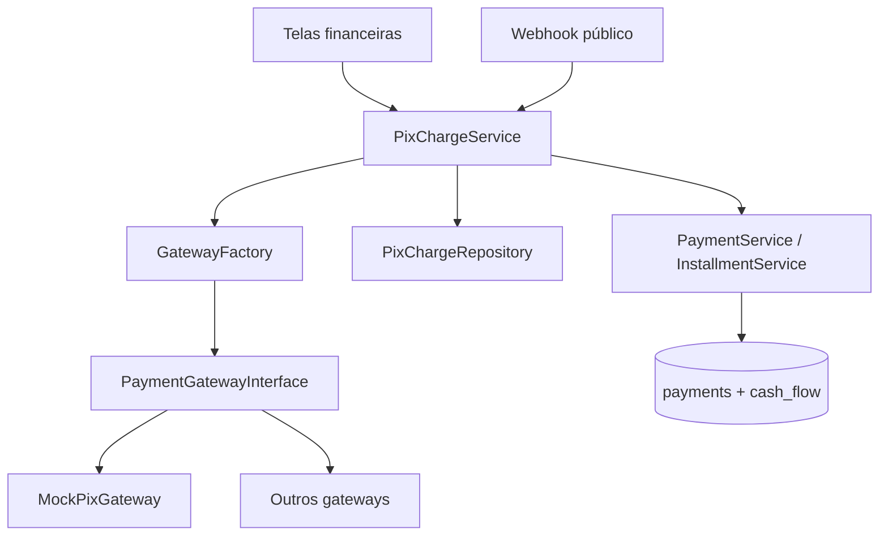

# 18 — Integração PIX

## Objetivo

Cobrança PIX desacoplada de gateways, com QR Code, acompanhamento de status, conciliação automática no financeiro e comprovante.

## Arquitetura



- **Controllers:** apenas HTTP e redirecionamentos (`PixChargeController`, `PixWebhookController`).
- **Service:** `PixChargeService` — criação, polling, webhook e conciliação.
- **Integração:** `app/Integrations/Payment/` — interface + implementações por gateway.
- **Persistência:** tabela `pix_charges` + vínculo `payment_id` após conciliação.

## Tabela `pix_charges`

| Campo | Descrição |
|-------|-----------|
| `company_id` | Empresa (multiempresa) |
| `accounts_receivable_id` | Conta vinculada |
| `installment_id` | Parcela (opcional) |
| `gateway` | Nome do provedor (`mock`, …) |
| `external_id` | ID no gateway |
| `amount` | Valor da cobrança |
| `status` | `pending`, `paid`, `expired`, `canceled` |
| `qr_payload` | PIX copia e cola |
| `qr_image_url` | URL da imagem QR |
| `receipt_reference` | Referência do comprovante |
| `payment_id` | Recebimento ERP após conciliação |

## Rotas

| Método | Rota | Permissão | Descrição |
|--------|------|-----------|-----------|
| GET | `/finance/pix/charge` | financeiro / visualizar | QR Code + polling |
| GET | `/finance/pix/receipt` | financeiro / visualizar | Comprovante |
| GET | `/finance/pix/status` | financeiro / visualizar | JSON status (polling) |
| POST | `/finance/pix/create-account` | financeiro / criar | Cobrança na conta |
| POST | `/finance/pix/create-installment` | financeiro / criar | Cobrança na parcela |
| POST | `/finance/pix/simulate-pay` | financeiro / criar | Simula pagamento (gateway mock) |
| POST | `/webhooks/pix/mock` | público | Webhook do gateway mock |

## Configuração (`config/.env`)

```env
PIX_ENABLED=true
PIX_DEFAULT_GATEWAY=mock
PIX_CHARGE_TTL_SECONDS=3600
PIX_WEBHOOK_SECRET=
PIX_MERCHANT_NAME=Mini ERP
PIX_MERCHANT_CITY=Sao Paulo
```

## Migration

```bash
php database/run_migration.php
```

Arquivo: `database/migrations/016_create_pix_charges.sql`

## Fluxo de uso

1. Em **Contas a receber → Registrar recebimento** ou **Baixa de parcela**, use **Gerar QR Code PIX**.
2. Cliente paga via QR ou copia e cola; a tela consulta status a cada 4s.
3. Ao confirmar (`paid`), o sistema concilia via `PaymentService` ou `InstallmentService` (método `pix`).
4. Abra **Comprovante PIX** com TX, referência e link ao recebimento ERP.

### Testes com gateway mock

- Botão **Simular pagamento (testes)** na tela do QR, ou
- Webhook:

```bash
curl -X POST http://localhost/mini-erp-vendas/public/webhooks/pix/mock \
  -H "Content-Type: application/json" \
  -d '{"external_id":"ERPXXXXXXXX","status":"paid"}'
```

## Novo gateway

1. Implemente `PaymentGatewayInterface` em `app/Integrations/Payment/Gateways/`.
2. Registre em `GatewayFactory::make()`.
3. Adicione rota de webhook em `public/index.php` e `AuthMiddleware::PUBLIC_ROUTES`.
4. Configure credenciais em `config/app.php` / `.env`.

## Verificação manual

1. Conta sem parcelas → gerar PIX → QR exibido.
2. Simular pagamento → conta conciliada, fluxo de caixa com entrada PIX.
3. Venda parcelada → PIX só pela tela de parcela.
4. Comprovante exibe TX e recebimento ERP.
5. Registro manual de recebimento continua funcionando.
